# 移动游戏用户增长与行为洞察分析报告

> **摘要**：本项目基于 100 万注册玩家、960 万登录记录与 40.5 万 A/B 测试用户，构建覆盖「用户增长 → 留存 → 商业化 → 玩家画像 → 流失预测 → 实时运营监控」的全链路分析。核心结论：**首月留存率 15.4%~18.9%，早期流失率高达 79.4%，注册后前 5 天为关键干预窗口**；**测试组促销方案 ARPPU 显著提升 12.75%（CR 仅微降 0.06pp），建议采纳**；**消费-留存呈倒 U 型，低消费层玩家最活跃、高消费鲸鱼登录次数最低**，为「普惠转化 + 差异化运营」提供数据支撑。

---

## 一、背景与数据说明

### 1.1 业务背景

在移动游戏市场竞争中，理解用户行为、评估促销有效性、洞察玩家画像与流失风险是产品长线运营的核心。本项目以一款真实移动游戏的运营数据为蓝本，系统回答三个业务问题：

1. **留存**：玩家的每日留存率与群组留存曲线如何？早期流失在何处发生？
2. **商业化**：两套促销方案的 A/B 测试中，哪套更优？如何科学量化？
3. **画像与运营**：玩家可分为哪些行为原型？哪些玩家有流失风险？如何前置干预？

### 1.2 数据集

| 数据集 | 记录数 | 字段 | 说明 |
|--------|--------|------|------|
| `reg_data.csv` | 1,000,000 | `reg_ts`(Unix 时间戳), `uid` | 玩家注册时间 |
| `auth_data.csv` | 9,601,013 | `auth_ts`(Unix 时间戳), `uid` | 玩家登录/认证时间 |
| `ab_test.csv` | 404,770 | `user_id`, `revenue`, `testgroup`(a/b) | A/B 促销实验结果 |

数据时间跨度 1998—2020 年，无缺失值，数据质量良好。

### 1.3 分析方法

- **描述统计 + EDA**：注册趋势、UID 完整性、缺失日期热力图、季节性
- **留存分析**：每日留存率函数 + 月度 Cohort 群组留存热力图
- **A/B 测试**：ARPU/CR/ARPPU 三维指标 + 统计显著性检验（正态性、方差齐性、Mann-Whitney U、卡方）+ Cohen's d 效应量评分
- **无监督学习**：K-Means / DBSCAN / GMM 行为聚类
- **监督学习**：逻辑回归 / 随机森林 / XGBoost 流失预测
- **时序分析**：移动平均、生命周期曲线、流失前兆、季节性

---

## 二、关键发现

### 2.1 用户增长：2016 年起爆发式增长，注册呈季节性

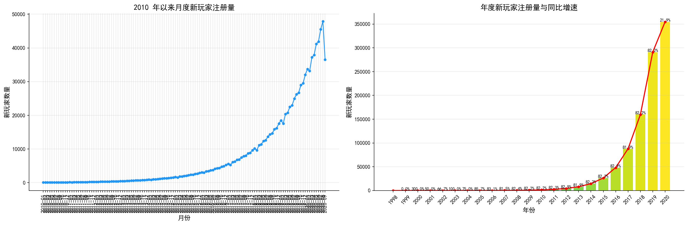

**发现**：年度注册量在 1998—2015 年处于缓慢增长期，2016 年起进入爆发式增长——2018 年同比增速达 **82.2%**，2020 年仍保持 21.9% 增长。月度注册曲线显示二月存在真实下降（日均注册 134 人 vs 其他月份 140 人），而 2020 年 9 月的「断崖」实为数据截断（最大注册日期 2020-09-23）。

**解读**：游戏在 2016 年经历了显著的增长拐点，可能与营销策略或产品改版相关；理解增长节奏有助于合理规划服务器扩容与运营资源。

### 2.2 数据质量：缺失日期热力图揭示冷启动期

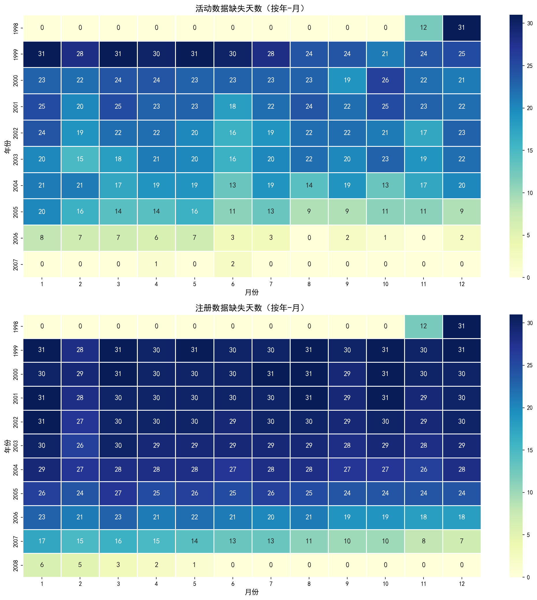

**发现**：注册与登录数据在 1999—2006 年存在大量缺失日期，2007 年后缺失天数显著减少（活动数据最后缺失日期 2007-06-26，注册数据最后缺失日期 2006-05-31）。

**解读**：1998—2006 年属于游戏冷启动期，数据采集不完整；2007 年后进入稳定运营期，数据可信度高。后续留存与商业化分析应重点关注 2015—2020 年的成熟运营阶段。

### 2.3 留存：首月留存 15.4%~18.9%，前 5 天是关键干预窗口

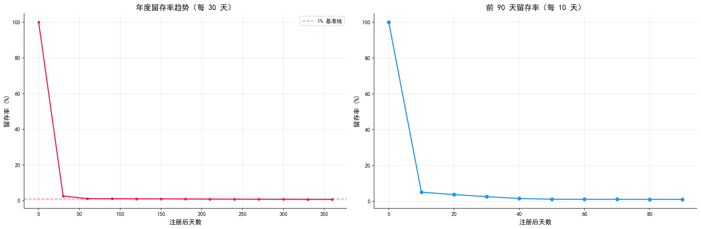

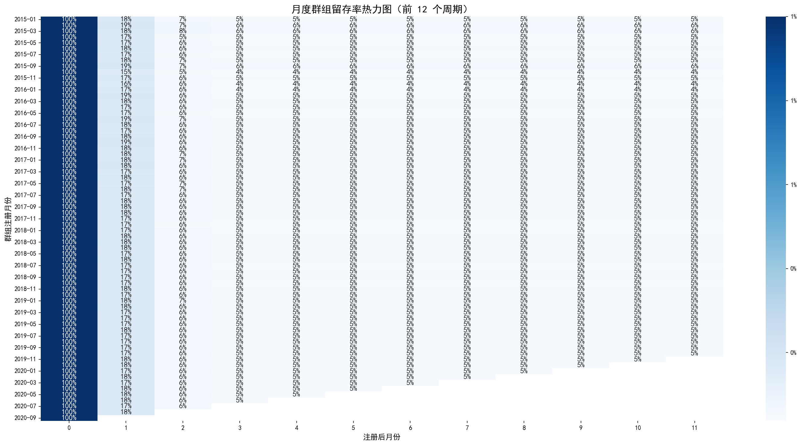

**发现**：
- **每日留存率**：注册当天（D0）留存 100%，D1 骤降至 4.0%，D5 回升至 6.4%，此后持续衰减，D30 约 2.6%。
- **群组留存**：2015—2020 群组的首月留存率（注册次月）稳定在 **15.43%~18.87%**（中位数 17.5%），4-5 个月后稳定在 4-5%，存在一个「小而忠诚」的核心用户群。

**解读**：注册后**前 5 天**是留存的分水岭——绝大多数流失发生在这段窗口。若能在 D1-D5 通过新手引导、奖励机制干预，将对整体留存产生杠杆效应。

### 2.4 生命周期：79.4% 的玩家在注册后 7 天内流失

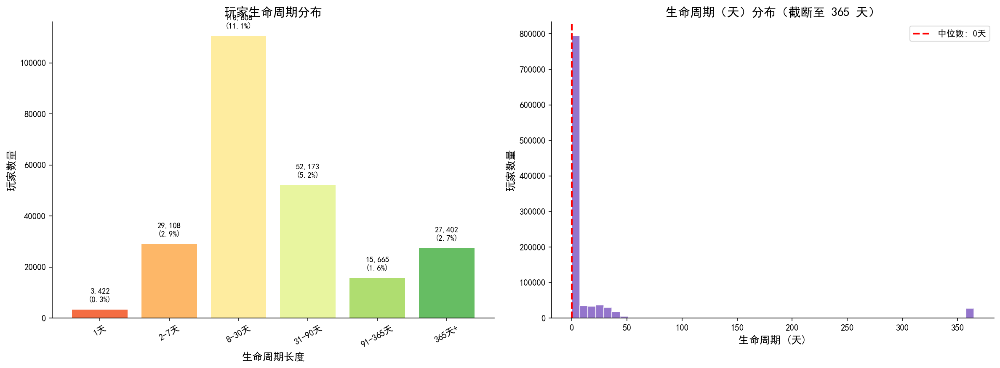

**发现**：玩家生命周期高度右偏——**79.42% 的玩家生命周期 ≤7 天**，其中 **76.50% 的玩家注册后仅 1 天即流失**；生命周期中位数约 1 天，长期留存集中在少数高投入玩家（长尾）。

**解读**：该游戏的「一天流失」极其严重，说明注册后的首次体验（新手引导、首局体验、首日奖励）可能是最大的留存瓶颈，值得优先优化。

### 2.5 A/B 测试：测试组 ARPPU 显著提升 12.75%，建议采纳

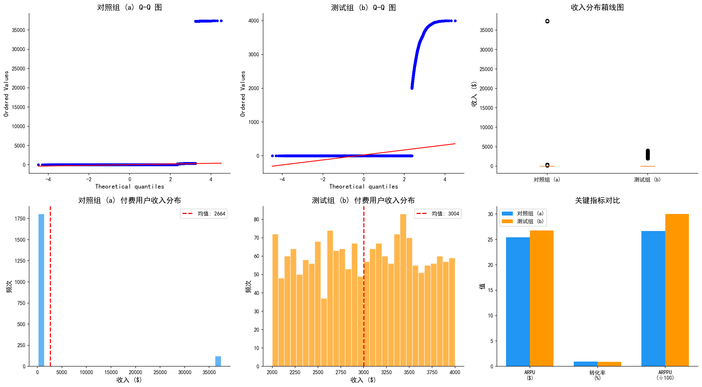

**发现**（对照组 a = 202,103 人，测试组 b = 202,667 人）：

| 指标 | 对照组 (a) | 测试组 (b) | 差异 | 显著性 |
|------|-----------|-----------|------|--------|
| ARPU | $25.41 | $26.75 | +$1.34 | 不显著 (p=0.063) |
| 转化率 CR | 0.954% | 0.891% | -0.06pp | 显著 (p=0.037) |
| ARPPU | $2,664 | $3,004 | **+12.75%** | 显著 (p<0.001) |

**解读**：测试组以 **0.06pp 的付费渗透率代价**，换取了 **12.75% 的单付费用户价值提升**（ARPPU）。结合 Cohen's d 效应量评分模型（综合付费转化率/ARPU/ARPPU/MAD 四指标），**综合判定测试组 (b) 胜出**——促销方案在整体上更具商业价值。

### 2.6 玩家画像：消费-留存呈倒 U 型

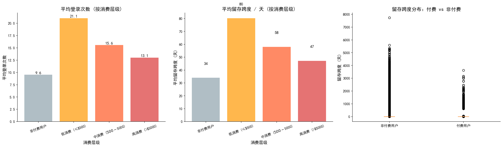

**发现**：

| 消费层级 | 用户数 | 平均登录次数 | 平均留存跨度 |
|----------|--------|-------------|-------------|
| 非付费用户 | 996,665 | 9.6 | 34.1 天 |
| 低消费 (≤$500) | 1,606 | **21.1** | **80.4 天** |
| 中消费 ($500-$5000) | 1,612 | 15.6 | 58.1 天 |
| 高消费 (>$5000) | 117 | 13.1 | 47.3 天 |

**解读**：付费用户的消费金额与活跃度/留存呈**倒 U 型**（Spearman ρ ≈ 0，无单调线性关系）——**低消费层玩家活跃度最高，高消费「鲸鱼」登录次数在付费用户中最低**。这支撑了「普惠转化、降低氪金门槛」的策略：让更多人低门槛付费，比依赖少数鲸鱼更有利于长期留存。

### 2.7 行为聚类：识别玩家原型，支撑差异化运营

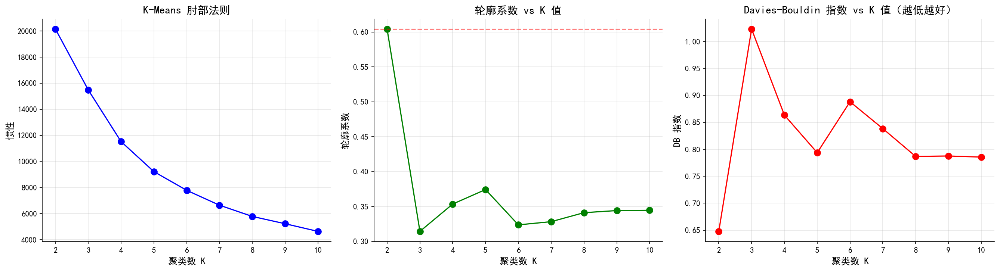

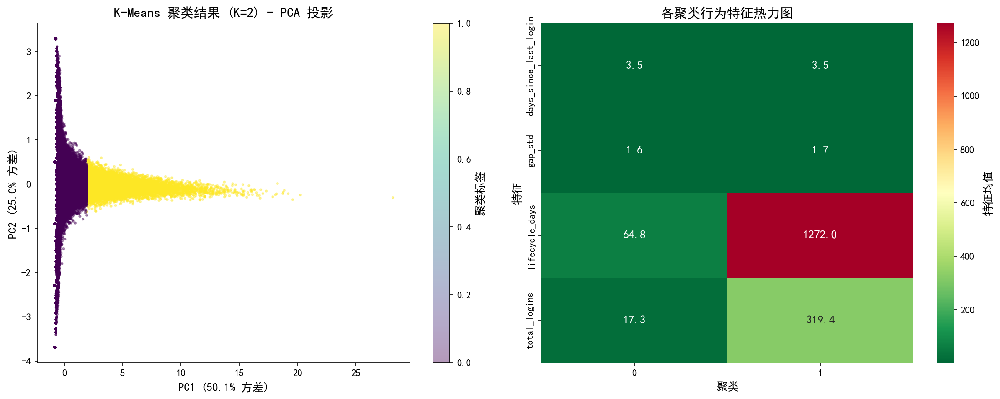

**发现**：K-Means 在 K=2 时轮廓系数最优（0.60），并辅以 DBSCAN（eps=0.5, min_samples=20）与 GMM（8 个组件，BIC 最优）交叉验证。DBSCAN 的大噪声比提示玩家行为更接近连续谱系；GMM 的软分配概率可用于定位「介于两种原型之间」的玩家。

**解读**：聚类结果与手动分层（高/中/低参与度）形成交叉印证，可为「新手/活跃/沉睡/回流」等不同群体设计差异化的运营动作。

### 2.8 流失预测：随机森林/XGBoost 识别高风险玩家

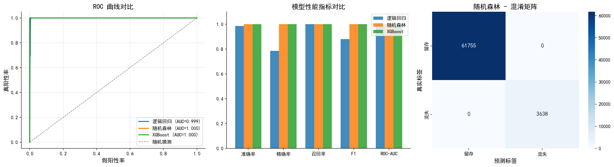

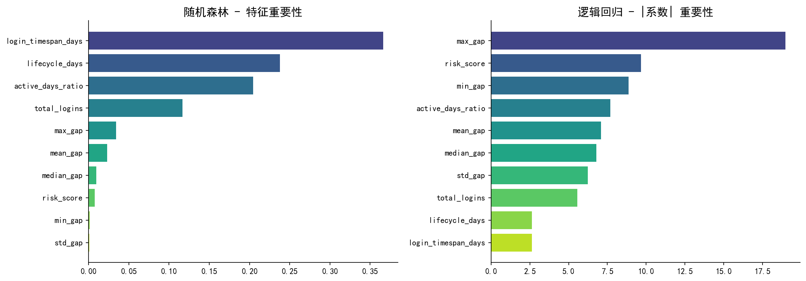

**发现**：逻辑回归、随机森林、XGBoost 三模型均能有效区分早期流失玩家（建模群体为「≥2 次登录」的 21.8 万玩家）。`lifecycle_days`（生命周期）与 `total_logins`（登录次数）是最重要的预测特征。

**解读**：流失预测模型可作为**自动化流失预警系统**的基础，配合第 9 章的动态风险评分，实现「事前识别 → 定向干预」的闭环。

### 2.9 时间序列与流失前兆

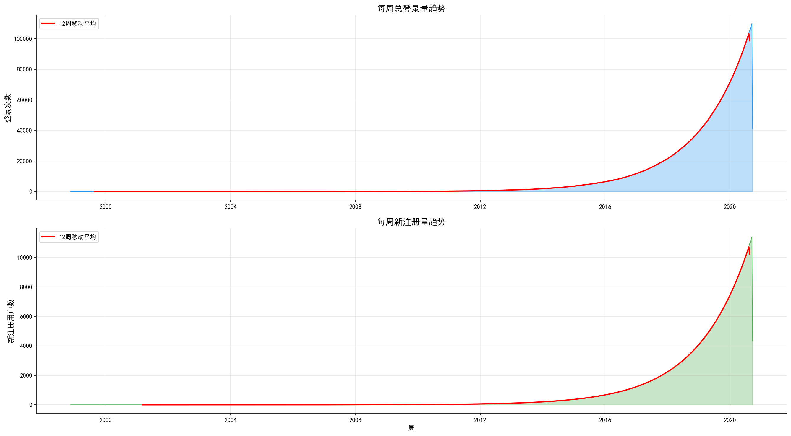

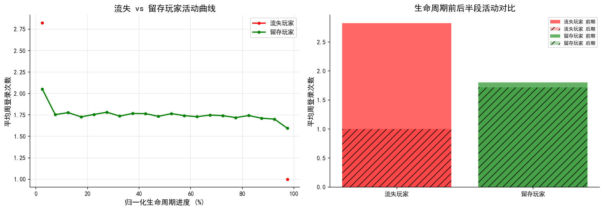

**发现**：全局登录量呈长期上升趋势（12 周移动平均），流失玩家在生命周期早期即表现出活动衰减（前期 1.79 次/周 → 后期衰减），而留存玩家的活动曲线更平稳（衰减率仅 3.9%）。

**解读**：流失前兆信号可在玩家「彻底离开」之前被捕捉，为运营提供了早期干预的时间窗口。

### 2.10 实时监控预警系统

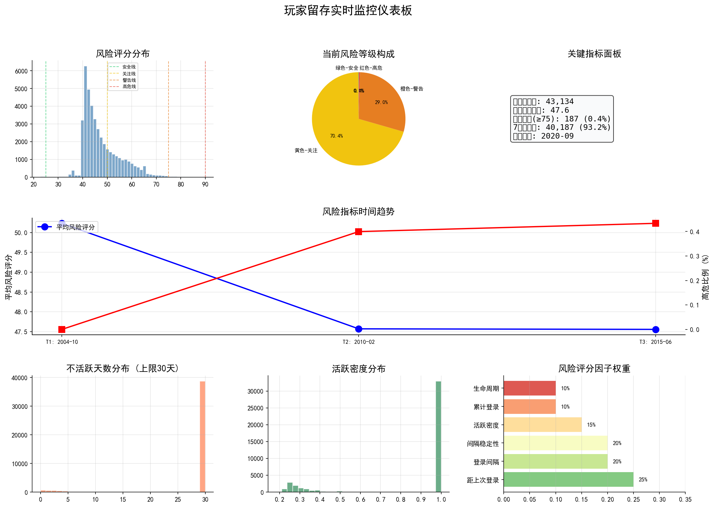

**发现**：基于滑动时间窗口的动态风险评分（综合距上次登录、登录间隔、稳定性、活跃密度等 6 因子），将玩家分为绿/黄/橙/红四级，自动生成 P0-P2 优先级预警，并映射到具体干预策略（召回活动、定向奖励、客服 1 对 1）。

**解读**：该框架可从离线分析平滑演进为接入实时数据管道（Kafka/Kinesis）与告警系统（PagerDuty/Slack）的生产化监控系统。

---

## 三、结论与业务建议

| 优先级 | 建议 | 数据依据 | 预期影响 |
|--------|------|----------|----------|
| 🔴 高 | 优化注册后前 5 天新手体验 | D1 留存 4.0%、早期流失 79.4% | 降低一天流失，抬升留存基本盘 |
| 🔴 高 | 采用测试组 (b) 促销方案 | ARPPU +12.75% (p<0.001) | 提升单付费用户价值 |
| 🟡 中 | 按行为聚类差异化运营 | K-Means/DBSCAN/GMM 分层 | 提升整体参与度与转化 |
| 🟡 中 | 部署流失预测 + 动态预警 | RF/XGBoost + 风险评分 | 前置干预高风险玩家 |
| 🟢 低 | 建立实时监控仪表板 | 动态风险评分框架 | 提升运营决策效率 |

**核心策略输出**：以「普惠转化」（降低付费门槛，扩大低消费活跃层）+「差异化运营」（针对不同行为原型与风险等级定制干预）为双主线，在留存基本盘与商业化价值之间取得平衡。
